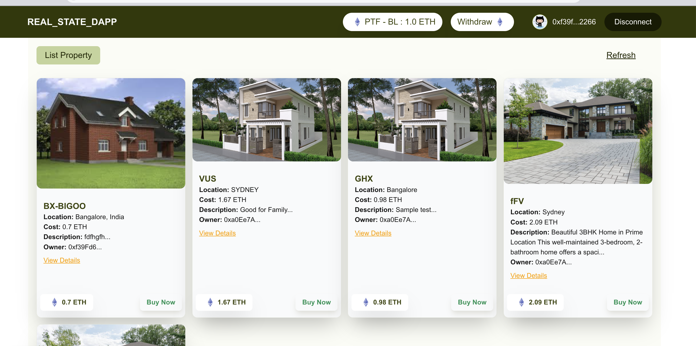
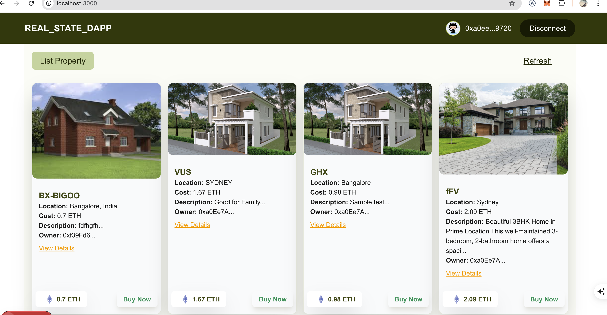

# Real Estate DApp

This is a decentralized real estate application (DApp) built with nextjs and Ethereum smart contracts. The platform allows sellers to list properties for sale and buyers to purchase properties using ETH. The platform charges a fee for each property listing, which is collected and can later be withdrawn by the platform owner.

## Features

- **Seller:**
  - List properties for sale on the platform.
  - Pay a platform fee when listing a property.
- **Buyer:**
  - Browse available properties.
  - Purchase properties using ETH.
  - Once a property is purchased, it is removed from the listing.
- **Platform Owner:**
  - Receives platform fees from property listings.
  - Can withdraw accumulated ETH fees from the platform.

## Getting Started

First, run the development server:
```bash
npm run install

```

```bash
npm run dev

```

Open [http://localhost:3000](http://localhost:3000) with your browser to see the result.

You can start editing the page by modifying `app/page.tsx`. The page auto-updates as you edit the file.

## Platform Flow

1. **Seller lists a property:**
   - The seller provides property details and pays a platform fee.
   - The property is added to the public listing.
2. **Buyer purchases a property:**
   - The buyer selects a property and completes the purchase with ETH.
   - The property is removed from the listing after purchase.
3. **Platform owner withdraws fees:**
   - The platform owner can withdraw accumulated platform fees at any time.

## Role-based Access

- **Platform Owner:** Can withdraw platform fees.
- **Seller:** Can list properties (with a fee).
- **Buyer:** Can purchase properties.

## Screenshots






